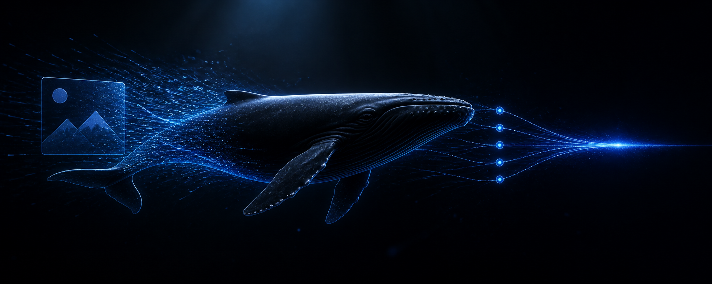
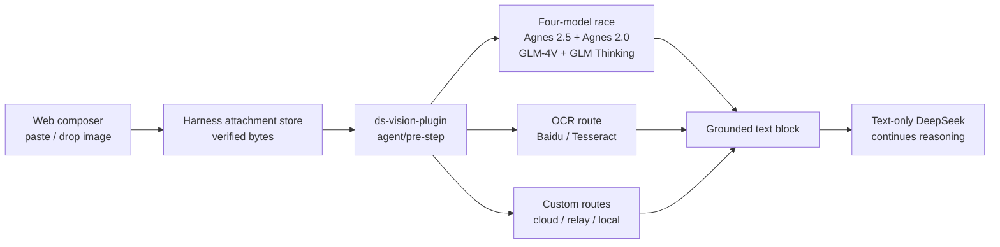

<p align="center">
  
</p>

<h1 align="center">ds-vision-plugin</h1>

<p align="center">
  <strong>Paste an image. Let four vision models race. Keep DeepSeek text-only.</strong>
</p>

<p align="center">
  <a href="README.zh-CN.md">简体中文</a>
  ·
  <a href="#quick-start">Quick start</a>
  ·
  <a href="#routing-model">Routing</a>
  ·
  <a href="VERIFICATION.md">Verification</a>
  ·
  <a href="LICENSE">License</a>
</p>

<p align="center">
  <a href="https://github.com/Sorwcyra/ds-vision-plugin/actions/workflows/ci.yml"></a>
  <a href="https://github.com/Sorwcyra/ds-vision-plugin/stargazers"></a>
  <a href="https://github.com/Sorwcyra/ds-vision-plugin/forks"></a>
  <a href="https://github.com/Sorwcyra/ds-vision-plugin/commits/main"></a>
  <a href="https://github.com/Sorwcyra/ds-vision-plugin/issues"></a>
  <a href="LICENSE"></a>
</p>

<p align="center">
  
  
  
  
</p>

<p align="center"><code>paste → attachment → race ×4 → grounded text → DeepSeek</code></p>

An installable [DeepSeek Harness](https://github.com/deepseek-ai/deepseek-harness) bundle that gives a text-only DeepSeek model a natural image-input experience. Paste or drop an image into the Web composer; the plugin reads Harness's verified attachment, races configured vision models or OCR, replaces the image with grounded text at `agent/pre-step`, and lets DeepSeek continue normally.

> [!NOTE]
> No Harness source fork is required. The plugin also exposes `vision_analyze` and `vision_status` for workspace files and diagnostics.

## Why it exists

| User need | Plugin answer |
|---|---|
| Paste screenshots directly into a text-only DeepSeek chat | Automatic Web attachment-to-text conversion |
| Avoid waiting on one slow or unavailable visual provider | Four models start together; first valid result wins |
| Reuse the proven `ds-vision-skill` route design | Agnes 2.5 + Agnes 2.0 + GLM-4V-Flash + GLM-4.1V-Thinking-Flash |
| Add a private relay, paid model, or local runtime | Unlimited OpenAI-compatible race or fallback routes |
| Configure without hand-editing YAML | Guided CLI for setup, keys, status, custom models, and live verification |
| Keep failures understandable | Visible annotation or strict failure; images are never silently discarded |

## Why choose this plugin

- **Native paste/drop UX:** users attach images directly in the Harness Web composer without first saving a path or naming a tool.
- **The proven `ds-vision-skill` four-model pattern:** Agnes 2.5, Agnes 2.0, GLM-4V-Flash, and GLM-4.1V-Thinking-Flash start together; the first valid response is handed to DeepSeek.
- **No GLM 4.6 dependency:** the default configuration, routing, and tests contain no `glm-4.6v-flash` route.
- **No Harness source fork:** the implementation uses a scoped Host capability bridge, durable attachments, and the official `agent/pre-step` extension.
- **Low setup friction:** the CLI creates configuration, reports channel readiness, saves masked keys on Windows, adds arbitrary OpenAI-compatible models, and verifies a real image.
- **Open-ended routing:** user models are not limited to three slots and can join either the concurrent race or ordered fallback.
- **Explicit failure behavior:** images are never silently discarded; deployments choose visible annotation or strict failure.

The four-way race can start four provider requests for each uncached image. It is recommended when latency and availability matter most. If request count, cost, or data exposure matters more, remove channels from `routing.race` or prefer local VLM/OCR routes.

## Routing model



- Automatic conversion for Web image attachments; default route filter: `deepseek-official`.
- Multiple images per message and images nested in tool results.
- Four-model first-success race: `agnes-2.5-flash`, `agnes-2.0-flash`, `glm-4v-flash`, and `glm-4.1v-thinking-flash`; losing requests are cancelled.
- `glm-4.6v-flash` is not used.
- Any number of user-owned OpenAI-compatible models can be added to the race or ordered fallback.
- Prompt-aware OCR routing to Baidu OCR or local Tesseract; VLM fallback if OCR is unavailable.
- Custom hosted endpoints plus local Ollama/LM Studio support.
- YAML hot reload, result caching, timeouts, size limits, and real-path confinement for the manual file tool.
- Strict failure or visible failure annotation; images are never silently dropped.
- Secrets are named by environment variable and are not returned by `vision_status`.

## Quick start

Requirements: Node.js 22.19+ or 24+. Run one command in PowerShell, Command Prompt, bash, or zsh:

```sh
npx -y github:Sorwcyra/ds-vision-plugin
```

The command installs or updates the plugin when needed, creates the four-model configuration without overwriting an existing one, guides key setup, starts the Web profile on the Harness-configured default port, and opens the browser. The plugin does not override that default (currently 3080). Run the same command next time. If the default port is already serving, it simply opens the existing Web UI instead of starting a duplicate process.

Useful options:

| Option | Purpose |
|---|---|
| `npx -y github:Sorwcyra/ds-vision-plugin --update` | reinstall even when the package version matches |
| `npx -y github:Sorwcyra/ds-vision-plugin --port 8080` | explicitly override the Harness Web port |
| `npx -y github:Sorwcyra/ds-vision-plugin --no-open` | start without opening a browser |
| `npx -y github:Sorwcyra/ds-vision-plugin --no-start` | install and configure only |

<details>
<summary>Manual installation and local development</summary>

```powershell
$env:npm_config_ignore_workspace_root_check = 'true'
npx -y @deepseek-ai/dsh plugin --profile web add "github:Sorwcyra/ds-vision-plugin"
```

Using the prebuilt tarball:

```powershell
$env:npm_config_ignore_workspace_root_check = 'true'
npx -y @deepseek-ai/dsh plugin --profile web add "C:\absolute\path\to\ds-vision-plugin-0.4.0.tgz"
```

Local checkout:

```sh
pnpm install
pnpm run build
dsh plugin --profile web add file:/absolute/path/to/ds-vision-plugin
```

</details>

## Configuration CLI

After installation, create the default four-model race and inspect missing keys:

```powershell
& "$env:USERPROFILE\.dsh\profiles\web\node_modules\.bin\ds-vision.cmd" configure
& "$env:USERPROFILE\.dsh\profiles\web\node_modules\.bin\ds-vision.cmd" status
```

Save GLM or Agnes keys interactively on Windows (input is masked):

```powershell
& "$env:USERPROFILE\.dsh\profiles\web\node_modules\.bin\ds-vision.cmd" key glm
& "$env:USERPROFILE\.dsh\profiles\web\node_modules\.bin\ds-vision.cmd" key agnes-2.5-flash
```

One `GLM_API_KEY` enables both GLM models; one `AGNES_API_KEY` enables both Agnes models. Channels with missing keys are skipped immediately.

Run one live race and print the winning model:

```powershell
& "$env:USERPROFILE\.dsh\profiles\web\node_modules\.bin\ds-vision.cmd" verify --image "C:\path\test.png"
```

Add any OpenAI-compatible model without editing YAML:

```powershell
& "$env:USERPROFILE\.dsh\profiles\web\node_modules\.bin\ds-vision.cmd" add `
  --id my-vlm --base-url "https://example.com/v1/chat/completions" `
  --model "your-vision-model" --api-key-env "MY_VLM_API_KEY" --pool fallback
```

Use `--pool race` for concurrent first-success selection or `--pool fallback` for ordered use after the four defaults. The generated default is `~/.dsh/ds-vision/vision.yml`; `DS_VISION_CONFIG` can override it.

Linux/macOS:

```sh
export DS_VISION_CONFIG=/absolute/path/to/vision.yml
export GLM_API_KEY=...
export AGNES_API_KEY=...
dsh web
```

Windows PowerShell:

```powershell
$env:DS_VISION_CONFIG = 'C:\absolute\path\to\vision.yml'
$env:GLM_API_KEY = '...'
$env:AGNES_API_KEY = '...'
dsh web
```

### Automatic attachment settings

The bundle patch accepts these environment overrides:

| Variable | Default | Meaning |
| --- | --- | --- |
| `DS_VISION_AUTO_CONVERT` | `true` | Set to `false` to disable automatic Web attachment conversion. |
| `DS_VISION_AUTO_PROVIDERS` | `deepseek-official` | Comma-separated primary provider routes. Empty in a custom patch means all providers. |
| `DS_VISION_AUTO_INTENT` | `auto` | `auto`, `reason`, or `ocr`. Auto selects OCR when the request asks for text extraction. |
| `DS_VISION_AUTO_FAILURE_MODE` | `annotate` | `annotate` replaces a failed image with a visible error marker; `error` fails the step. |

For advanced overrides (`autoPrompt`, `autoComplex`, `autoAccurateOcr`), replace the complete `ds-vision` row config in the profile's `cordis.patch.yml`; Harness patch layers replace row configs rather than deep-merging them.

## Use

Start the Web profile, choose the DeepSeek provider, paste or drop one or more PNG/JPEG/WebP/GIF images into the composer, add an optional question, and send. No path or tool name is needed. The converted visual description becomes the model-facing durable message, so the settled transcript shows the generated text rather than retaining a core image block that the text-only adapter would reject.

For a workspace file, the model can still call:

```text
vision_analyze(path, prompt, intent, complex, accurate_ocr, no_cache)
```

Use `vision_status()` to inspect effective routing and automatic-conversion status without exposing keys.

## Privacy and failure behavior

Automatic Web attachments are read only through Harness's verified private attachment service. A configured cloud channel receives the image bytes. `allowedRoots` applies to explicit file paths, not Web attachments. Use a local VLM/Tesseract or disable automatic conversion for sensitive images.

The default `annotate` mode removes an unsupported image block only after emitting a clear conversion-failure marker, allowing DeepSeek to explain the issue. Use `error` when a failed conversion must stop the request.

## Build and verify

```sh
pnpm run build
pnpm run check
pnpm run pack:check
pnpm pack --pack-destination ./artifacts
```

### Simulate the default `ds-vision-skill` race

Run the deterministic four-model Mock without provider keys:

```powershell
pnpm run build
pnpm run test:race
```

| Model | Mock latency |
| --- | ---: |
| `glm-4v-flash` | 40 ms |
| `agnes-2.5-flash` | 120 ms |
| `agnes-2.0-flash` | 160 ms |
| `glm-4.1v-thinking-flash` | 200 ms |

The test asserts that all four requests start, `glm-4v-flash` wins first-success selection, and no 4.6 model exists in the default. The full `pnpm run check` additionally covers Host image admission, attachment-to-text conversion, failure modes, arbitrary CLI-added models, and path security.

See `VERIFICATION.md` for the tested upstream commit, automated cases, package contents, and isolated Harness installation result.

## Related project

This plugin adapts the four-model routing pattern from [`ds-vision-skill`](https://github.com/Sorwcyra/ds-vision-skill) to the DeepSeek Harness Web composer and lifecycle.

## Star history

<a href="https://www.star-history.com/?repos=Sorwcyra%2Fds-vision-plugin&type=date&legend=top-left">
  
</a>

## Contributors

Bug reports, provider fixes, documentation improvements, and new routing strategies are welcome.

<a href="https://github.com/Sorwcyra/ds-vision-plugin/graphs/contributors">
  
</a>

## License

Released under the [MIT License](LICENSE).
