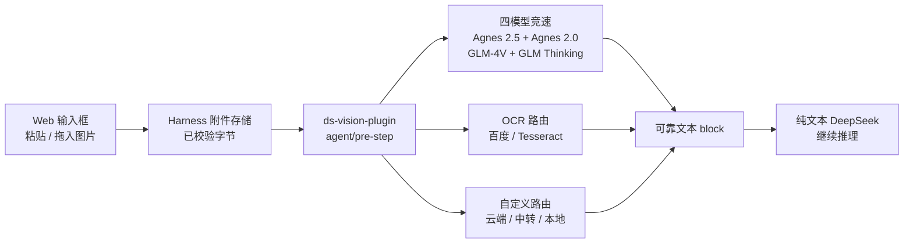

<p align="center">
  
</p>

<h1 align="center">ds-vision-plugin</h1>

<p align="center">
  <strong>直接贴图，四模型竞速，纯文本 DeepSeek 也能看图。</strong>
</p>

<p align="center">
  <a href="README.md">English</a>
  ·
  <a href="#快速开始">快速开始</a>
  ·
  <a href="#路由模型">路由模型</a>
  ·
  <a href="VERIFICATION.md">验证记录</a>
  ·
  <a href="LICENSE">许可证</a>
</p>

<p align="center">
  <a href="https://github.com/Sorwcyra/ds-vision-plugin/actions/workflows/ci.yml"></a>
  <a href="https://github.com/Sorwcyra/ds-vision-plugin/stargazers"></a>
  <a href="https://github.com/Sorwcyra/ds-vision-plugin/forks"></a>
  <a href="https://github.com/Sorwcyra/ds-vision-plugin/commits/main"></a>
  <a href="https://github.com/Sorwcyra/ds-vision-plugin/issues"></a>
  <a href="LICENSE"></a>
</p>

<p align="center">
  
  
  
  
</p>

<p align="center"><code>贴图 → 附件 → 四路竞速 → 可靠文本 → DeepSeek</code></p>

这是一个可安装的 [DeepSeek Harness](https://github.com/deepseek-ai/deepseek-harness) bundle，让纯文本 DeepSeek 主模型获得自然的图片输入体验。用户只要把图片粘贴或拖入 Web 输入框；插件读取 Harness 已校验的附件，并发调用视觉模型或 OCR，在 `agent/pre-step` 把图片替换成可靠文本，再让 DeepSeek 正常继续推理。

> [!NOTE]
> 不需要修改或 fork Harness 源码。插件同时提供 `vision_analyze` 与 `vision_status`，用于工作区文件识别和配置诊断。

## 为什么需要它

| 用户需求 | 插件方案 |
|---|---|
| 把截图直接贴进纯文本 DeepSeek 对话 | 自动把 Web 附件转换为文本 |
| 不想被单个视觉服务的慢响应或故障拖住 | 四个模型同时启动，首个有效结果获胜 |
| 复用经过验证的 `ds-vision-skill` 路由思路 | Agnes 2.5 + Agnes 2.0 + GLM-4V-Flash + GLM-4.1V-Thinking-Flash |
| 接入私有中转、付费模型或本地运行时 | 可添加任意数量的 OpenAI-compatible 竞速或降级路由 |
| 不想手工编辑 YAML | CLI 引导配置、密钥、状态、自定义模型和真实图片验证 |
| 失败时需要知道发生了什么 | 显式错误标注或严格失败，图片不会被静默丢弃 |

## 为什么推荐

- **贴图体验完整**：用户直接在 Harness Web 输入框粘贴或拖入图片，不用先保存路径，也不用手动点名工具。
- **复用 `ds-vision-skill` 的四模型思路**：默认同时调用 Agnes 2.5、Agnes 2.0、GLM-4V-Flash、GLM-4.1V-Thinking-Flash，首个有效结果直接交给 DeepSeek。
- **不依赖 GLM 4.6**：默认配置、路由和测试均不包含 `glm-4.6v-flash`。
- **不修改 Harness 源码**：使用 Host 能力桥接、持久附件服务和官方 `agent/pre-step` 扩展点，插件可独立安装和卸载。
- **配置门槛低**：命令行向导可以创建配置、检查通道、隐藏输入并保存密钥、添加其他 OpenAI-compatible 模型、执行真实图片验证。
- **容易扩展**：自定义模型数量不限，可以加入并发竞速池，也可以作为有序 fallback。
- **失败可见**：图片不会被静默丢弃；可选择错误标注或严格中止。

四路竞速意味着每张未命中缓存的图片最多会启动四个云端请求。适合重视低延迟与可用性的场景；对调用次数、费用或敏感数据更在意时，可以从 `routing.race` 删除通道，或改用本地模型/OCR。

## 路由模型



- 自动处理 Web 图片附件，默认只作用于 `deepseek-official` 路由。
- 支持一条消息多图，以及工具结果中的嵌套图片。
- 默认四模型同时竞速：`agnes-2.5-flash`、`agnes-2.0-flash`、`glm-4v-flash`、`glm-4.1v-thinking-flash`；第一个有效结果获胜，其余请求立即取消。
- 不调用 `glm-4.6v-flash`。
- 可添加任意数量的 OpenAI-compatible 模型，放入并发池或顺序降级队列。
- 根据用户问题自动选择百度 OCR 或本地 Tesseract；OCR 不可用时继续降级到视觉模型。
- 支持自定义云端地址、本地 Ollama 和 LM Studio。
- YAML 热读取、缓存、超时、大小限制；手动文件工具带真实路径隔离。
- 可选严格失败或显式错误标注，绝不会静默丢图。
- 密钥只通过环境变量名引用，`vision_status` 不返回密钥。

## 快速开始

要求 Node.js 22.19+ 或 24+。在 PowerShell、命令提示符、bash 或 zsh 中只运行这一条：

```sh
npx -y github:Sorwcyra/ds-vision-plugin quickstart
```

它会按需安装或更新插件、生成四模型配置且不覆盖已有配置、引导设置密钥、在 3080 端口启动 Web，并自动打开浏览器。以后启动仍然运行同一条命令。如果 3080 已有服务，它只会打开现有页面，不会重复启动。

常用选项：

| 选项 | 作用 |
|---|---|
| `--update` | 即使版本号相同也重新安装 GitHub 当前版本 |
| `--port 8080` | 换一个 Web 端口 |
| `--no-open` | 启动但不自动打开浏览器 |
| `--no-start` | 只安装和配置，不启动 Web |

<details>
<summary>手动安装和本地开发</summary>

```powershell
$env:npm_config_ignore_workspace_root_check = 'true'
npx -y @deepseek-ai/dsh plugin --profile web add "github:Sorwcyra/ds-vision-plugin"
```

安装预构建 tarball：

```powershell
$env:npm_config_ignore_workspace_root_check = 'true'
npx -y @deepseek-ai/dsh plugin --profile web add "C:\absolute\path\to\ds-vision-plugin-0.4.0.tgz"
```

本地源码安装：

```sh
pnpm install
pnpm run build
dsh plugin --profile web add file:/absolute/path/to/ds-vision-plugin
```

</details>

## 命令行配置向导

安装后运行向导。它会在 `~/.dsh/ds-vision/vision.yml` 生成四模型竞速配置、显示缺少的密钥，并可继续添加自定义模型：

```powershell
& "$env:USERPROFILE\.dsh\profiles\web\node_modules\.bin\ds-vision.cmd" configure
```

查看状态：

```powershell
& "$env:USERPROFILE\.dsh\profiles\web\node_modules\.bin\ds-vision.cmd" status
```

交互式保存 GLM 或 Agnes 用户级密钥（输入时隐藏）：

```powershell
& "$env:USERPROFILE\.dsh\profiles\web\node_modules\.bin\ds-vision.cmd" key glm
& "$env:USERPROFILE\.dsh\profiles\web\node_modules\.bin\ds-vision.cmd" key agnes-2.5-flash
```

同一个 `GLM_API_KEY` 同时启用 `glm` 和 `glm-thinking`；同一个 `AGNES_API_KEY` 同时启用两个 Agnes 模型。未配置对应密钥的通道会立即跳过，不会影响其他已配置通道。

用一张图片验证真实四路竞速并显示获胜模型：

```powershell
& "$env:USERPROFILE\.dsh\profiles\web\node_modules\.bin\ds-vision.cmd" verify --image "C:\path\test.png"
```

### 添加其他视觉模型

向导支持任意数量的 OpenAI-compatible 模型，不再限制 `custom-1/2/3`：

```powershell
& "$env:USERPROFILE\.dsh\profiles\web\node_modules\.bin\ds-vision.cmd" add `
  --id my-vlm `
  --base-url "https://example.com/v1/chat/completions" `
  --model "your-vision-model" `
  --api-key-env "MY_VLM_API_KEY" `
  --pool fallback
```

`--pool race` 会加入并发竞速；`--pool fallback` 会在四模型全部失败后按顺序调用。密钥仍单独存放，不写入 YAML，也不会被 `vision_status` 返回。

也可以直接编辑配置，或通过 `DS_VISION_CONFIG` 指定其他路径。

Linux/macOS：

```sh
export DS_VISION_CONFIG=/absolute/path/to/vision.yml
export GLM_API_KEY=...
export AGNES_API_KEY=...
dsh web
```

Windows PowerShell：

```powershell
$env:DS_VISION_CONFIG = 'C:\absolute\path\to\vision.yml'
$env:GLM_API_KEY = '...'
$env:AGNES_API_KEY = '...'
npx -y @deepseek-ai/dsh web
```

更新插件后必须退出旧的 `dsh web` 进程再启动；只刷新网页不会重新加载 bundle。如果提示 `EADDRINUSE 127.0.0.1:3080`，说明旧服务仍在占用端口，应先关闭启动它的 PowerShell 窗口（或在该窗口按 `Ctrl+C`），再执行启动命令。

### 自动贴图配置

bundle patch 支持以下环境变量：

| 变量 | 默认值 | 作用 |
| --- | --- | --- |
| `DS_VISION_AUTO_CONVERT` | `true` | 设为 `false` 可关闭 Web 图片自动转换。 |
| `DS_VISION_AUTO_PROVIDERS` | `deepseek-official` | 逗号分隔的主模型 provider 路由。自定义 patch 中设为空数组可匹配全部 provider。 |
| `DS_VISION_AUTO_INTENT` | `auto` | `auto`、`reason` 或 `ocr`；用户要求提取文字时，`auto` 会选择 OCR。 |
| `DS_VISION_AUTO_FAILURE_MODE` | `annotate` | `annotate` 用可见错误标记替换失败图片；`error` 直接让当前 step 失败。 |

高级选项 `autoPrompt`、`autoComplex`、`autoAccurateOcr` 可在 profile 的 `cordis.patch.yml` 中覆盖。注意 Harness 的后续 patch 会整体替换该行的 `config`，不是深度合并，因此要把 `ds-vision` 行所需字段完整写出。

## 使用

启动 Web profile，选择 DeepSeek provider，把一张或多张 PNG/JPEG/WebP/GIF 图片粘贴或拖入输入框，可同时输入问题，然后直接发送；不需要填写路径或点名工具。插件只为 `autoProviders` 中的路由向 Host 声明可接收图片，随后在模型调用前把图片转换为文本，因此纯文本 DeepSeek 适配器不会收到任何 `image` block。插件卸载时会恢复原始模型能力解析。

对于工作区文件，模型仍可调用：

```text
vision_analyze(path, prompt, intent, complex, accurate_ocr, no_cache)
```

可用 `vision_status()` 查看自动转换和后端路由状态，不会泄露密钥。

## 隐私与失败策略

Web 图片只通过 Harness 已校验的私有附件服务读取；配置的云端通道会收到图片字节。`allowedRoots` 只限制显式文件路径工具，不限制 Web 附件。敏感图片请使用本地视觉模型/Tesseract，或关闭自动转换。

默认 `annotate` 模式会移除纯文本模型不支持的图片 block，并留下明确的转换失败说明，让 DeepSeek 告知用户；需要强一致性时请改为 `error`。

## 构建与验证

```sh
pnpm run build
pnpm run check
pnpm run pack:check
pnpm pack --pack-destination ./artifacts
```

### 模拟 `ds-vision-skill` 的默认四路竞速

无需真实密钥即可单独运行 Mock 竞速测试：

```powershell
pnpm run build
pnpm run test:race
```

测试服务器会模拟以下响应时间：

| 模型 | Mock 延迟 |
| --- | ---: |
| `glm-4v-flash` | 40 ms |
| `agnes-2.5-flash` | 120 ms |
| `agnes-2.0-flash` | 160 ms |
| `glm-4.1v-thinking-flash` | 200 ms |

断言会验证四个模型请求全部启动、`glm-4v-flash` 首先胜出，并且配置中不存在 4.6。完整 `pnpm run check` 还覆盖 Web Host 放行、附件转文本、失败策略、CLI 自定义模型和路径安全。

`VERIFICATION.md` 记录了参考的官方源码提交、自动化覆盖、包内容和隔离环境安装结果。

## 相关项目

本插件把 [`ds-vision-skill`](https://github.com/Sorwcyra/ds-vision-skill) 的四模型路由思路适配到了 DeepSeek Harness Web 输入框和插件生命周期中。

## Star 趋势

<a href="https://www.star-history.com/?repos=Sorwcyra%2Fds-vision-plugin&type=date&legend=top-left">
  
</a>

## 贡献者

欢迎提交 bug、视觉通道修复、文档优化和新的路由策略。

<a href="https://github.com/Sorwcyra/ds-vision-plugin/graphs/contributors">
  
</a>

## 许可证

本项目使用 [MIT License](LICENSE)。
